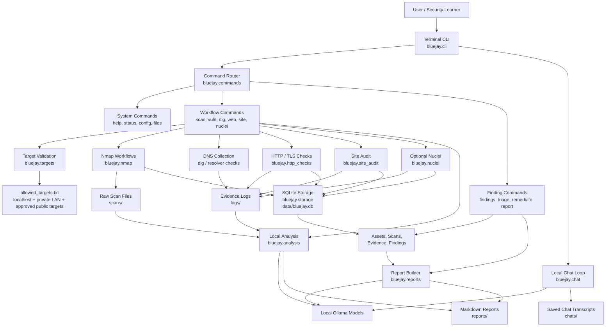
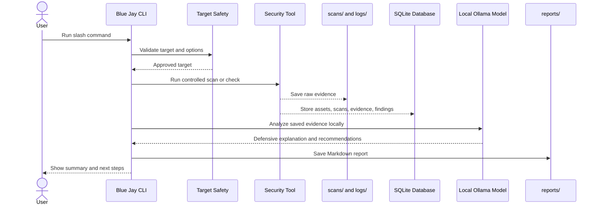
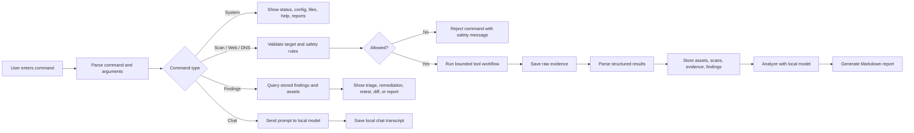
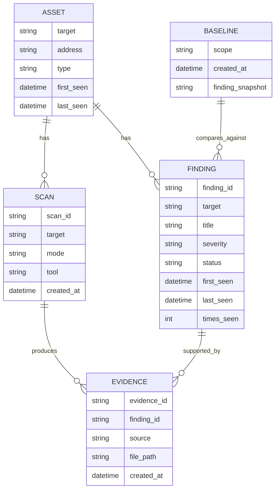
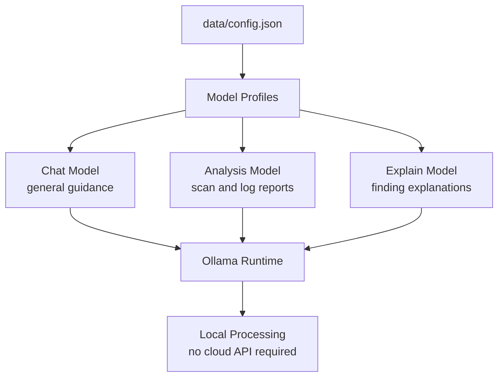
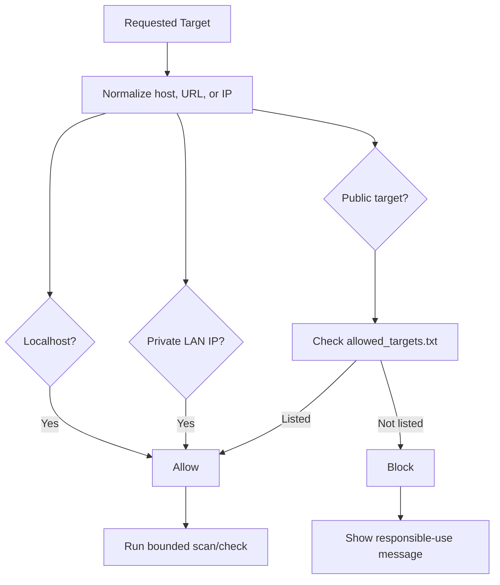
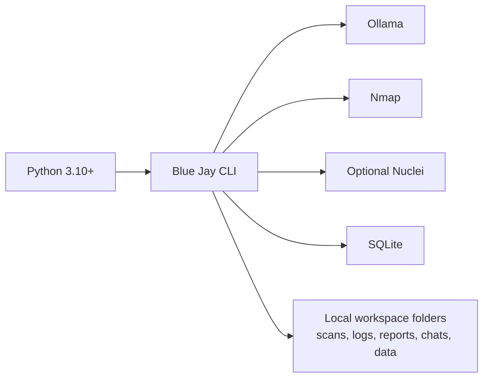

# Blue Jay System Architecture

Blue Jay is a local-first defensive security assistant. It provides a terminal interface for controlled security checks, stores evidence locally, and uses local Ollama models to explain scan results and generate reports.

## Architecture Overview

## Main Components

| Component | Responsibility |
| --- | --- |
| `app.py` | Thin entrypoint for launching the application. |
| `bluejay.cli` | Starts the terminal UI, chat loop, and slash-command handling. |
| `bluejay.commands` | Routes slash commands to the correct command module. |
| `bluejay.cmd_system` | Handles help, status, config, files, reports, and chat commands. |
| `bluejay.cmd_workflows` | Handles scan, DNS, web, site audit, Nuclei, profile, and analysis workflows. |
| `bluejay.cmd_findings` | Handles assets, findings, triage, remediation, retest, baselines, diffs, and reports. |
| `bluejay.targets` | Normalizes targets and enforces safe target rules. |
| `bluejay.nmap` | Runs controlled Nmap scans and parses XML output into structured findings. |
| `bluejay.http_checks` | Performs HTTP, TLS, security-header, and cookie checks. |
| `bluejay.site_audit` | Runs bounded same-origin crawling and website checks. |
| `bluejay.nuclei` | Runs optional bounded Nuclei scans and parses JSONL output. |
| `bluejay.storage` | Stores assets, scans, evidence, and findings in SQLite. |
| `bluejay.analysis` | Sends scan/log evidence to local Ollama models for defensive analysis. |
| `bluejay.reports` | Builds evidence-based Markdown reports from stored findings. |
| `bluejay.config` | Manages local model profile configuration. |
| `bluejay.ui` | Provides terminal rendering, prompts, history, and completions. |

## Data Flow

## Command Workflow

## Local Storage Model

## Model Profiles

## Safety Boundaries

Blue Jay is designed for defensive and authorized use. Target validation is applied before active workflows run.

## Deployment Model

Blue Jay runs as a local Python application. It depends on local tools for scanning and local model execution.

## Summary

Blue Jay is structured as a modular local security workbench:

- The CLI provides a beginner-friendly interactive interface.
- Command modules separate system, workflow, and finding-management behavior.
- Tool integrations collect raw evidence from Nmap, DNS, HTTP/TLS checks, website audits, and optional Nuclei scans.
- SQLite stores assets, scans, evidence, findings, baselines, and scan history.
- Local Ollama models generate explanations and reports without sending scan data to a cloud service.
- Markdown reports and saved chat transcripts provide repeatable learning and remediation records.
