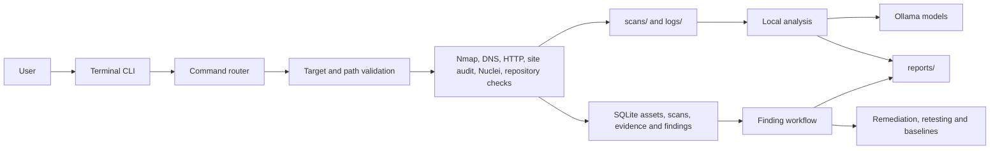
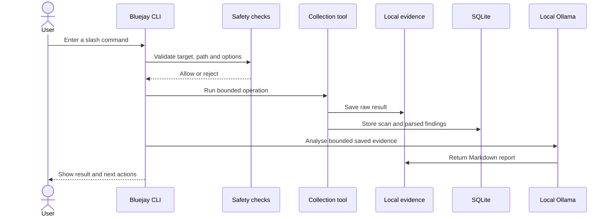
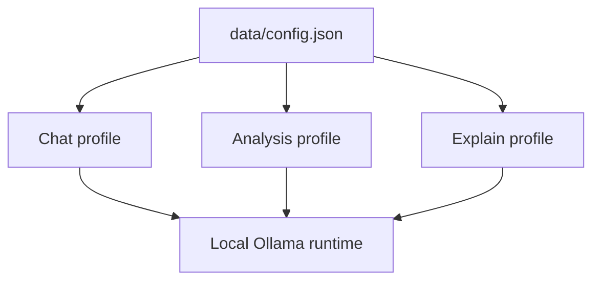

# Architecture and local storage

Bluejay is a local Python application that connects controlled collection tools to persistent evidence, findings and remediation workflows. Local Ollama models sit behind that workflow as an analysis layer.

## System overview

The Python application decides which tool can run, validates its input, applies limits and saves the result. The local model receives evidence for interpretation but does not receive shell access.

## Main modules

| Component | Responsibility |
| --- | --- |
| `app.py` and `bluejay.__main__` | Thin launch entry points. |
| `bluejay.cli` | Starts the interface, chat transcript and command loop. |
| `bluejay.commands` | Parses and routes slash commands. |
| `bluejay.cmd_system` | Handles help, status, configuration, file, report and chat commands. |
| `bluejay.cmd_workflows` | Coordinates scan, DNS, web, site, Nuclei, profile, repository and file-analysis workflows. |
| `bluejay.cmd_findings` | Handles assets, history, findings, triage, remediation, retesting, baselines and reports. |
| `bluejay.targets` | Normalises targets and enforces allowlist rules for active checks. |
| `bluejay.nmap` | Runs controlled Nmap scans and parses Nmap XML. |
| `bluejay.dns` | Collects basic and advanced DNS evidence with a resolver fallback. |
| `bluejay.http_checks` | Performs HTTP, TLS, security-header and cookie checks. |
| `bluejay.site_audit` | Runs the bounded same-origin website audit. |
| `bluejay.nuclei` | Runs optional bounded Nuclei scans and parses JSONL. |
| `bluejay.web` | Provides the shared exports for web, site and Nuclei workflows. |
| `bluejay.repository_checks` | Performs bounded, read-only local manifest and Dockerfile checks. |
| `bluejay.storage` | Stores assets, scans, evidence and findings in SQLite. |
| `bluejay.baselines` | Saves finding snapshots and produces current-versus-baseline diffs. |
| `bluejay.analysis` | Sends bounded evidence to the configured local analysis model and saves Markdown. |
| `bluejay.reports` | Builds deterministic Markdown reports from stored findings. |
| `bluejay.config` | Loads and saves local Ollama profile names. |
| `bluejay.chat` | Maintains bounded local chat context and JSONL transcripts. |
| `bluejay.ui` | Provides terminal output, prompts, history and completion. |
| `bluejay.constants`, `tooling`, `utils` and `workspace` | Define limits and paths, report missing tools, provide shared helpers and initialise local storage. |
| `bluejay.optional_deps` | Loads the richer terminal dependencies when available and provides fallback state when they are not. |

## Collection workflow

Not every workflow performs every step. `/repo` produces a local Markdown report without structured findings or model analysis. `/report` reads stored findings and writes deterministic Markdown without calling Ollama. Chat uses Ollama and a local transcript but does not run collection tools.

## Finding storage

SQLite is the primary state store at `data/bluejay.db`.

| Record | Key information |
| --- | --- |
| Assets | Target, type, first seen, last seen and metadata. |
| Scans | ID, target, profile, tool, status, command, output paths and metadata. |
| Findings | Stable fingerprint, status, severity, confidence, evidence, source, recommendation and occurrence history. |
| Evidence | Finding ID, collection time, source and evidence content. |

When a parser observes the same fingerprint again, Bluejay updates the existing finding, increments `times_seen`, saves new evidence and reopens the finding if necessary. Baselines are JSON snapshots stored separately under `data/baselines/`.

## Runtime directories

| Path | Contents |
| --- | --- |
| `scans/` | Nmap normal and XML output. |
| `logs/` | DNS, HTTP, website and Nuclei evidence, plus user-provided logs for analysis. |
| `reports/` | Model-assisted analysis, structured finding reports, baseline diffs and repository reports. |
| `chats/` | Saved JSONL chat transcripts. |
| `data/bluejay.db` | Primary SQLite database. |
| `data/findings.jsonl` | Compatibility mirror of findings. |
| `data/config.json` | Model profile overrides. |
| `data/baselines/` | Saved finding snapshots. |
| `data/history.txt` | Terminal command history. |
| `allowed_targets.txt` | Explicitly approved public targets. |

These locations are relative to the directory where Bluejay is run. Generated content is ignored by Git apart from placeholder files.

## Model profiles

The role split allows general chat, evidence analysis and single-finding explanations to use different local models. See [Local AI](local-ai.md) for setup and configuration.

## Safety boundaries

- Active Nmap and web workflows allow localhost, private or link-local IPs and explicitly allowlisted public targets.
- Web redirects are revalidated before they are followed.
- Commands call external programs without a shell.
- Nmap, DNS, HTTP, Nuclei and Ollama operations have timeouts.
- Site crawling is limited by origin, page count, queued links and response size.
- `/analyse` and `/repo` cannot escape the project directory.
- Nuclei uses bounded severity input, rate limits, timeouts and retry settings.
- Raw evidence remains separate from model-generated explanation.

These controls reduce accidental misuse but do not grant authorisation. The operator is responsible for confirming scope and permission before any active assessment.

## Deployment model

Bluejay runs as a local terminal application. Python provides the workflow and storage layer, SQLite provides persistence, Nmap and optional Nuclei provide external scanning, built-in Python networking provides HTTP and TLS checks, and Ollama provides local model execution.

There is currently no server component, remote account system or cloud service in the repository.
